<div align="center">

# 👋 Hi, I'm Michael Merino

### 💻 Computer Science Engineering Student & Full-Stack Developer

<p>
  Building modern web and mobile applications with a focus on
  <b>clean code</b>, <b>scalable architectures</b> and
  <b>great user experiences</b>.
</p>

<p>
  📍 Quito, Ecuador &nbsp;•&nbsp;
  🌎 English B2 &nbsp;•&nbsp;
  🚀 Always learning and building
</p>

<br/>

<a href="https://www.linkedin.com/in/michael-merino">
  
</a>

<a href="mailto:maikijunior9@gmail.com">
  
</a>

<a href="https://portafolio-michael-merino-wqho.vercel.app">
  
</a>

</div>

<br/>

---

## 🚀 About Me

I'm a **Full-Stack Developer** and Computer Science Engineering student passionate about turning ideas into reliable, maintainable and user-focused software.

I enjoy working across the entire development lifecycle — from designing responsive interfaces and mobile experiences to developing APIs, backend services, databases and deployment pipelines.

```typescript
const michael = {
  location: "Quito, Ecuador 🇪🇨",

  role: "Full-Stack Developer",

  frontend: [
    "Angular",
    "React",
    "TypeScript",
    "JavaScript"
  ],

  backend: [
    "Java / Spring Boot",
    "Node.js",
    "Python"
  ],

  mobile: [
    "Ionic",
    "React Native",
    "Flutter"
  ],

  databases: [
    "PostgreSQL",
    "MySQL",
    "MongoDB",
    "Firebase"
  ],

  cloudAndDevOps: [
    "Docker",
    "AWS",
    "Azure",
    "CI/CD",
    "Linux",
    "GitHub Actions"
  ],

  currentlyFocusedOn: [
    "Software Architecture",
    "Cloud Computing",
    "DevOps",
    "Scalable Systems",
    "AI Integration"
  ]
};
```

## 📊 GitHub Activity

<div align="center">

<picture>
  <source
    media="(prefers-color-scheme: dark)"
    srcset="./assets/profile/overview.dark.svg"
  />
  <source
    media="(prefers-color-scheme: light)"
    srcset="./assets/profile/overview.light.svg"
  />
  
</picture>

<br/><br/>

<picture>
  <source
    media="(prefers-color-scheme: dark)"
    srcset="./assets/profile/contributions.dark.svg"
  />
  <source
    media="(prefers-color-scheme: light)"
    srcset="./assets/profile/contributions.light.svg"
  />
  
</picture>

</div>

---

## 💻 Languages

<div align="center">

<picture>
  <source
    media="(prefers-color-scheme: dark)"
    srcset="./assets/profile/languages.dark.svg"
  />
  <source
    media="(prefers-color-scheme: light)"
    srcset="./assets/profile/languages.light.svg"
  />
  
</picture>

</div>

---

## 📈 Contribution History

<div align="center">

<picture>
  <source
    media="(prefers-color-scheme: dark)"
    srcset="./assets/profile/lifetime.dark.svg"
  />
  <source
    media="(prefers-color-scheme: light)"
    srcset="./assets/profile/lifetime.light.svg"
  />
  
</picture>

</div>

---

<details>
<summary><b>📊 More GitHub Analytics</b></summary>

<br/>

<div align="center">

### Contribution Composition

<picture>
  <source
    media="(prefers-color-scheme: dark)"
    srcset="./assets/profile/composition.dark.svg"
  />
  <source
    media="(prefers-color-scheme: light)"
    srcset="./assets/profile/composition.light.svg"
  />
  
</picture>

<br/><br/>

### Development Rhythm

<picture>
  <source
    media="(prefers-color-scheme: dark)"
    srcset="./assets/profile/rhythm.dark.svg"
  />
  <source
    media="(prefers-color-scheme: light)"
    srcset="./assets/profile/rhythm.light.svg"
  />
  
</picture>

</div>

</details>
